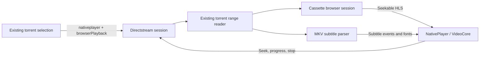

# Browser torrent playback

This fork adds torrent playback to Seanime’s existing NativePlayer/VideoCore in a web browser. It keeps episode selection, subtitle rendering, player events, progress, and continuation in the existing application.

Base: upstream `5rahim/seanime`, commit `2da73d9eb59af15b004ef4e9018ac9db6fff213a` (`v3.10.3`). The three playback commits originated on `feat/browser-torrent-playback` and are merged into this fork's `main`. Git remotes: `origin` is [Cufee/seanime](https://github.com/Cufee/seanime), and `upstream` is `5rahim/seanime`. No upstream PR or Mac deployment has been performed.

## Enable playback

1. Run this fork on the Seanime server with FFmpeg and FFprobe available there. The [rootless Docker build and release package](docker.md) include both executables inside the container.
2. Enable media transcoding in Seanime’s server settings and configure its FFmpeg/FFprobe paths. The existing hardware acceleration and preset settings apply.
3. In the browser’s playback settings, enable **Play torrents in this browser**.
4. Start a torrent through the usual episode/torrent selection flow.

The browser preference is per device and defaults to off. The server’s MPV preference remains independent. Torrent streaming uses Seanime’s built-in torrent engine; this feature does not depend on Transmission or a VLC installation on the laptop.

The browser must actually support H.264 High level 4.0 and AAC decoding, through MediaSource/HLS.js or native HLS. The playback action checks those capabilities. Linux Firefox installations may need their system media codecs enabled.

## Implementation boundaries



- The torrent request adds optional `browserPlayback: true` while retaining `playbackType: "nativeplayer"`. Browser requests select VideoCore before metadata loads, independently of global MPV settings.
- The layout mounts the existing NativePlayer in browser builds. The payload adds optional `deliveryFormat: "hls"` and `disablePreview` fields. No second player or subtitle renderer is introduced.
- `internal/directstream/browser.go` prepares delivery **after** raw metadata is loaded. Probing the HTTP source inside `LoadPlaybackInfo` would recursively block on its `sync.Once`. The raw source info remains unchanged; a copy containing the HLS URL is sent to the player.
- `internal/mediastream/browser.go` owns one Cassette instance per playback. The existing library media container, filesystem checks, and disk transcode entrypoints remain separate.
- `/api/v1/directstream/hls/:id/*` serves manifests and segments. Existing HMAC authentication signs the specific playback path prefix. Segment and font requests reject stale playback IDs. Cancellation stops probes, encoder jobs, and input reads, then deletes the playback output directory.
- Preview extraction is disabled for this delivery mode because separate thumbnail seeks would compete for torrent pieces and encoder capacity. HLS fragment requests allow up to 120s to receive the first byte while missing pieces download; other streaming modes retain their timeout policy. Fatal native HLS errors use the existing player error event to stop server resources.

The integration uses a small source change because the current plugin API cannot enable the browser’s NativePlayer mount or change native playback transport and lifecycle at these boundaries. A plugin could provide an external link or separate player, but would not reuse this complete native flow without these core hooks.

## Seeking and codecs

`Cassette.NewStreamingSession` receives known media metadata, an explicit playback identity, a cancellable source, and optional validated video cues. It exposes the complete episode timeline immediately, without scanning all packets or encoding the preceding episode first.

Valid zero-start video cues allow compatible H.264 video to be copied. Missing, nonzero-start, or unsuitable indexes use a four-second timeline with forced video conversion. Converted video is constrained to H.264 High level 4.0, at most 1920×1080 and 30fps; audio is stereo AAC. Other codecs, high bit depth, and incompatible profiles are converted. This conservative delivery profile can reduce source resolution, frame rate, or audio channel count.

The streaming pipeline reuses Cassette’s encoder configuration, quality ladder, resource governor, and segment cache. It prepares only requested segments, deduplicates concurrent requests for the same segment, and cancels unfinished work when its last requester leaves. A preceding segment provides decoder/encoder warmup where needed. Two FFmpeg jobs may run concurrently in a browser session. Timestamps remain on a stable episode timeline across forward and backward seeks. Matroska/WebM files with a nonzero source start normalize video, duration, subtitle events, chapters, and seek lookup by the same offset. Raw source metadata and cached subtitle events remain unchanged.

Embedded subtitles remain on the incremental MKV event path; styled ASS is not flattened to WebVTT. The prerequisite seek fixes are independently useful:

- Read the actual Matroska `CueDuration` element (`0xB2`) and retain cue track/duration details.
- Preserve the first cluster when a parser starts at a known nonzero cluster offset, including the source timestamp scale.
- Include earlier subtitle events that still overlap the seek time. When cues cannot establish a safe starting point, or PGS needs prior decoder state, fall back to scanning from the start.
- Preserve ASS margin/read-order fields in the casing expected by the renderer.
- Deduplicate subtitles within an extraction generation, so canceled batches can be replayed after seeking. Assign generations in player-event order and replay subtitles when HLS recovery reloads metadata.

## Verification

Actual local browser results (2026-09-20):

| Browser | Source and authentication | Result |
| --- | --- | --- |
| Firefox 152.0.4 | H.264/AAC MKV, no password | Playback starts at 24% downloaded; cold seek to 60s, back to 5s, styled ASS and track switching pass. |
| Chromium 149.0.7827.200 | H.264/AAC MKV, password enabled | Playback, cold forward/backward seeking, signed HLS/font requests, dialogue plus styled signs, and subtitle track switching pass. |
| Firefox 152.0.4 | HEVC Main 10/AAC MKV, password enabled | Software conversion, playback before download completion, forward/backward seeking, signed HLS/fonts, styled signs plus dialogue, and subtitle track switching pass. |

The synthetic fixture has a 3 Mbps video stream and a loopback peer capped at 256 KiB/s. Firefox’s first frame took 32s; its cold forward seek took 32s and backward seek 2.7s. Chromium’s cold seek started at 25% downloaded and resumed at 93% after 92s; its backward seek took 2.7s. These measurements exercise waits for missing pieces under an intentionally constrained peer. Some embedded dialogue packets arrive late because of their physical placement in the file.

The HEVC run started playback at 43% downloaded after 119s, including a 60s initial peer connection delay. Its cold forward seek took 65s and backward seek 2.6s. Firefox adapted to 240p during sparse playback; Chromium retained 480p. The headless tests verify video decoding and subtitle rendering; audio timing is checked by FFmpeg tests, not by listening to browser output.

Passing automated checks:

- Full frontend typecheck and production build.
- 29 focused frontend tests covering playback selection, codec capability checks, subtitle generations, and HLS quality handling.
- Real FFmpeg integration through the authenticated directstream HLS endpoint, including requesting the final segment first, canceled-session URLs, replaced-session URLs, invalid paths, and attachment identity.
- A blocked HTTP probe is canceled promptly and releases its input request.
- All affected Go packages pass normal tests: directstream, mediastream and Cassette, videofile, torrentstream, playlist, VideoCore, Matroska, and MKV parsing.
- Cassette and media wrapper/probe suites pass with `-race`, including H.264 remux, HEVC 10-bit conversion, nonzero source start, sparse indexes, audio timing, and cancellation.
- Parser suites and focused directstream browser/subtitle tests pass with `-race`.
- The HTTP torrent-start regression verifies that the browser flag reaches the repository.

A handler test (`TestUsesPrivilegedCommandSettings/ignores_default_executable_paths`) fails on this Linux host because it treats macOS application paths as defaults. The same failure was reproduced in a clean worktree at the upstream base commit; it is unrelated to this feature. The full directstream race run also finds a shared logging `bytes.Buffer` race in upstream lifecycle tests, reproduced in that clean worktree. The focused new browser/subtitle race tests pass.

The ignored `local_testing/browser-playback/` directory holds the local executable, synthetic fixtures, browser harness, logs, and screenshots. The harness builds the real app using a Go overlay limited to restricting the test torrent client to loopback and disabling public discovery. Its private trackerless torrent has only an explicitly added local peer, with upload capped at 256 KiB/s. It starts playback through the normal HTTP request with the browser’s WebSocket identity; torrent search/selection is bypassed. No production testing endpoint or network restriction is added to Seanime. All fixture processes were stopped after testing.

No working LSP connection is available in this environment. Navigation used native source tools; verification uses TypeScript, Go tests/race checks, builds, FFmpeg, and actual browser execution.

## Known boundaries

- Current Firefox and Chromium have passed local runtime tests. Safari, mobile browsers, and macOS hardware acceleration require their own runtime validation before claiming support.
- iOS native video fullscreen can omit canvas subtitle overlays. Styled subtitle fullscreen on iOS is not yet verified; inline playback retains the existing renderer.
- Separate subtitle files inside torrents are not newly implemented; `TorrentStream.AppendSubtitleFile` is still an upstream stub. Embedded subtitles and the existing uploaded/external-subtitle UI are preserved.
- Shared upstream torrent state still allows one active torrent playback. Independent simultaneous TV/laptop sessions are outside this change.
- HDR conversion and every hardware encoder combination are not yet validated. CPU conversion is the tested fallback.
- A cold seek can still wait for the necessary torrent pieces. Unindexed subtitle fallback may need earlier pieces as well.
- Subtitle events beginning before a normalized playback origin are clipped to zero with their original expiry preserved. Animation phase within that clipped interval is not preserved.

## Maintaining the fork

Keep independent parser/subtitle corrections separate from Cassette’s streaming entrypoint and browser UI wiring when preparing upstream contributions. Avoid moving existing player files, adding a second service, or changing dependencies for this feature. Regenerate API types with `go generate ./codegen/main.go` after public schema changes.

The playback implementation consists of three commits: the Matroska parsing fixes, Cassette’s cancellable streaming sessions with media tests, and the native browser player integration with subtitle lifecycle fixes. Container packaging and release automation are separate. The normal package tests are tracked; machine-specific browser harness files and synthetic media remain ignored.

To update a clean branch, use native Git:

```sh
git fetch upstream
git rebase upstream/main
```

After a rebase, regenerate types, run the frontend build and focused tests, run the affected Go package tests with the race detector, and repeat the synthetic browser seek/subtitle test. Read `CONTRIBUTING.md` before proposing upstream changes; its maintainer discussion and AI-disclosure requirements apply to an upstream PR, not to local development of this fork.
